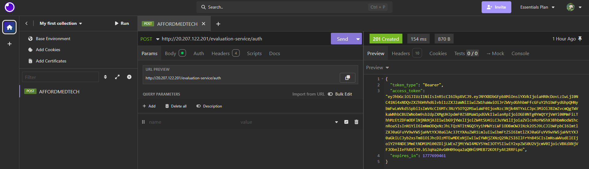
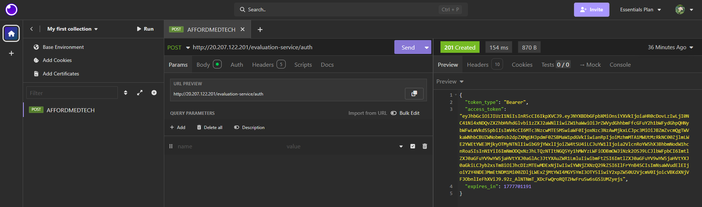
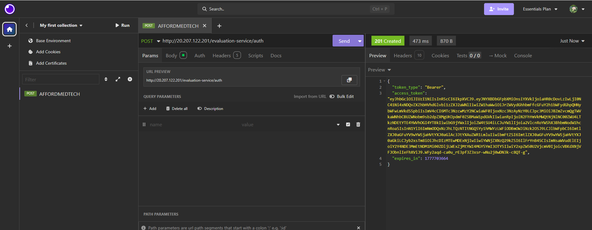
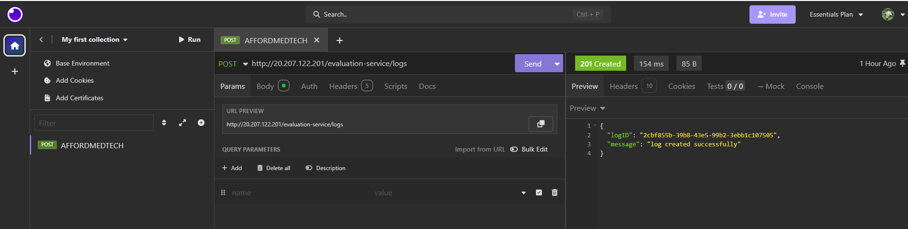
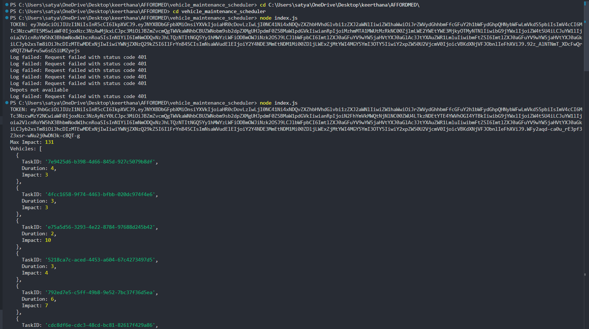
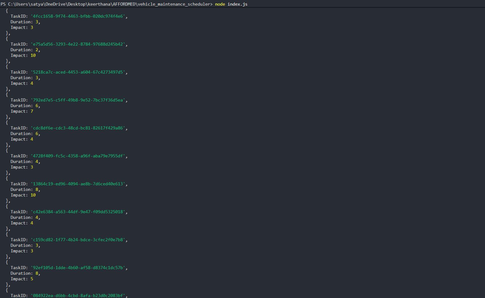
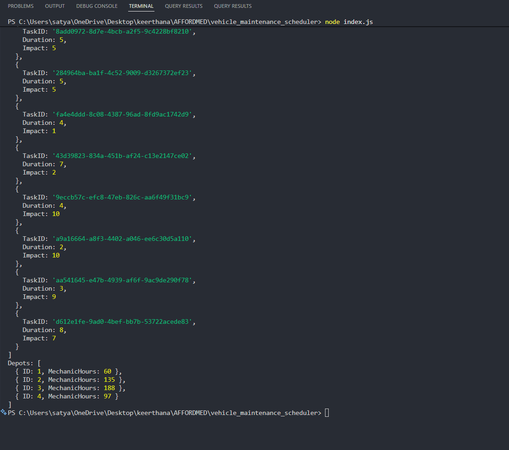
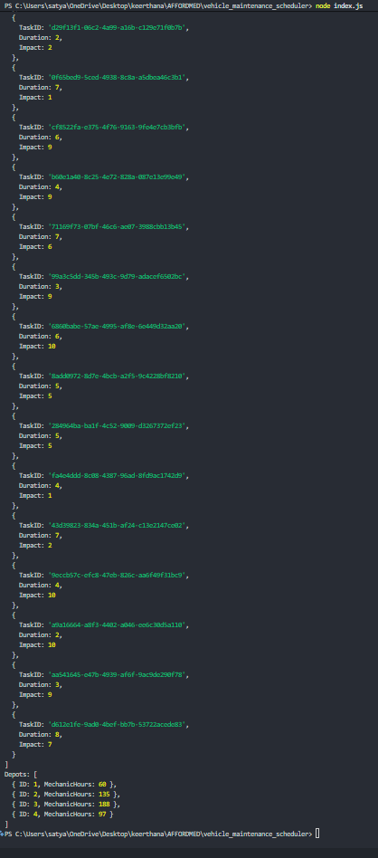

1. api design
get /notifications → used to fetch all notifications for a user
post /notifications → used to send a new notification
put /notifications/{id}/read → used to mark a notification as read
simple and clear endpoints for basic operations

2. database design

tables used:

users

userId (primary key)
name
email

notifications

id (primary key)
type
message
createdAt

user_notifications

id (primary key)
userId (foreign key)
notificationId (foreign key)
isRead

3. query optimization

query used:

select * from notifications
where studentID = 1042 and isRead = false
order by createdAt desc;

this query can become slow for large data
filtering and sorting together increases cost
use index on (studentID, isRead, createdAt)
this helps faster search and ordering

4. performance optimization
use pagination to limit number of results
use caching (like redis) to reduce database calls
proper indexing to improve query speed
use async processing for better performance

5. notify_all fix

problem:

if sending notification fails, system may become inconsistent
some users may not receive notification

solution:

use message queue to handle tasks
retry failed messages automatically
process notifications asynchronously
improves reliability and avoids data loss

6. priority inbox
notifications are ordered by importance
priority: placement > result > event
important notifications are shown first
sorting is based on priority and latest time

7. Screenshots

Register API

Auth API

2nd auth since 1st one timed out

3rd

Logging API

Depots API

Vehicles API

Output

